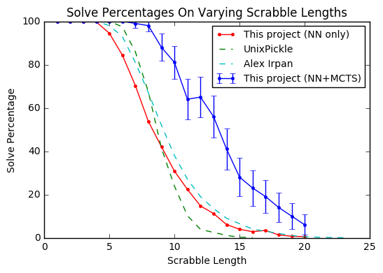

# Solving the puzzle cube with deep reinforcement learning and tree search #


This is a project to solve the 3x3x3 puzzle cube (a.k.a. the Rubik’s cube) using reinforcement learning.  While the puzzle cube is definitely a "solved problem"—there are many algorithms which can be used to solve a scrabbled cube—the goal is to have a computer learn *from scratch* how to do it.  In reinforcement learning a computer tries to solve a scrabbled cube on its own with little or no human knowledge, and then, through trial and error, slowly learns the best way to do it. 

More technically, I use a combination of a residual/convolutional neural network (NN) and Monte Carlo tree search (MCTS).  This is (almost) the same technique employed by Deepmind’s AlphaGo Zero and AlphaZero to play board games like Go and Chess at super human levels.

The puzzle cube is a fun choice for reinforcement learning, because it is non-trivial for a human to learn from scratch.  (For example, I don’t even know how to solve one, even though I have spent a number of years trying on my own.)  However, for some of those who do know an algorithm, solving the cube is second nature, involving just what seems to be pattern recognition and intuition, not deep mathematical reasoning.  This suggests that the right reinforcement learning algorithm could be used to learn to solve the cube—especially algorithms using neural networks, which are good at pattern recognition.

**Update 1, April 15, 2019:** _In the year since this project was completed, there has been a break through in using neural networks to solve the puzzle cube.  McAleer, Agostinelli, Shmakov, and Baldi
([preprint](https://arxiv.org/abs/1805.07470), [pre-conference version](https://openreview.net/forum?id=Hyfn2jCcKm)) independently used reinforcement learning to solve the puzzle cube.  There are many similarities between their work and mine including the use of Monte Carlo tree search.  Despite their progress, there is still a lot to be done on solving the puzzle cube with reinforcement learning.  While McAleer et al.'s trained algorithm solves any puzzle cube, it often takes hours to do so, whereas hand-programmed solvers can do so instantly.  See [this expository article](https://medium.com/datadriveninvestor/reinforcement-learning-to-solve-rubiks-cube-and-other-complex-problems-106424cf26ff) for an (unsuccessful) attempt to reproduce McAleer et al.'s results._


**Update 2, April 15, 2019:** _I made this code base much easier to use, and I've supplied pretrained weights so one doesn't have to train their own network.  See [Getting Started With The Code](#getting-started-with-the-code)._

## Results ##



This plot shows the performance of the neural network alone (that is the policy output of the neural network) and the neural network when combined with MCTS (which gives the neural network a boost but takes longer to run). (The MCTS plot contains error bars since I didn't generate enough samples to get a smooth plot.)

I also compare my work to the state of the art.  These two puzzle solving neural networks are the best I could find. (For more puzzle cube projects, see the [complete list](#list-of-neural-network-puzzle-cube-solvers) at the bottom of this page.)
- [Alex Irpan](https://github.com/alexirpan/rubik_research) (LSTM) ([poster](https://www.alexirpan.com/public/research/poster.pdf), [paper](https://www.alexirpan.com/public/research/nips_2016.pdf))
- [UnixPickle](https://github.com/unixpickle/godsalg) (feedforward/dense layers)

Both Alex Irpan's and UnixPickle's algorithms were trained using *supervised learning*—they were trained using known algorithms for solving the puzzle cube, whereas my approach used *reinforcement learning*—**it learned to solve the puzzle cube by all by itself!**

I still hold out hope that a different reinforcement algorithm can be used to solve the puzzle cube completely.  (See the [Further Ideas](#further-ideas) section below for some next steps.)

## Getting started with the code ##

### Cloning the repo ###
```bash
$ git clone --recursive https://github.com/jasonrute/puzzle_cube
```
(The `--recursive` ensures you clone the `code` submodule as well.)

### Using the pretrained network ###
```bash
$ cd puzzle_cube/code/
$ python3 example.py
```
To run this you will need TensorFlow, as well as a number of other packages which can be installed using pip.  The `example.py` script is designed to be easy to follow and adapt.  This code runs fine on my MacBook Air.

### Training a network from scratch ###
```bash
$ cd puzzle_cube/code/
$ python3 train.py
```
The output is a bit cryptic, but as long as it is running, it is training new networks which are stored in the `results` directory.  Training is too slow and memory intesive to run on my Macbook Air.  Instead I trained it for 34 generations (which took \~2 days) on an AWS g3.4x.large spot instance.

To dig in more, look at `code/config.py` for various settings that can be changed.  For example, lower the number of `games_per_generation` (a "game" is one attempt to solve a randomly shuffled cube).

### Other details ###
(If you are forking this project, you may have to fork both this respository and [jasonrute/puzzle_cube_code](https://github.com/jasonrute/puzzle_cube_code).  Then you may have to reassociate the URL for the `code` submodule.  I am not sure.  See [here](https://blog.github.com/2016-02-01-working-with-submodules/).)

The `code` directory is a separate repository.  After making any changes to the code, commit the changes to the code repository.  Then the results will be saved in a directory under `results`. (The directory is named using the `git describe` command which is run from inside the code repository.)  To use a trained model from a previous run put the name of that directory in the `prev_versions` list in the `config.py` file, e.g. 
`prev_versions = ['v1.0.2-r2', 'v1.0.2-r']`
 
## Some of the big ideas ##

A neural network is basically a black box which takes in input and gives output.  It can be trained with labeled data.  Our neural network has the following input and output.  (See [Neural network architecture](#neural-network-architecture) in Technical details section for the full architecture.)
- **Input:** A 54 x 6 bit representation of the cube and:  54 squares on the cube and 6 possible colors.  Actually, we also include the previous 7 states so the input is a 8 x 54 x 6 bit array.
- **Output 1 (Policy):** An probability distribution over the 12 possible moves: L L’ R R’ U U’ D D’ F F’ B B’
- **Output 2 (Value):** A number between 0 and 1 which represents how easy the cube is to solve from this state.  Ideally, the value approximates gamma^distance where gamma = .95 and distance is the number of steps needed to solve the cube.  In practice the value is closer to gamma^distance times the probability that our MCTS algorithm can solve the cube from this state.

At the beginning the neural network is just random (and is later trained).

The model is fed into a search algorithm based on Monte Carlo tree search (MCTS).  The network uses its policy algorithm to explore the tree of possible paths to a solved cube.  Since the number of paths growths exponentially, the tree search has to be judicious in choosing which branches to explore.  At each node in our tree search we continuously transition from *exploration* to *exploitation*:
- **Exploration:** Randomly pick the next best move using the neural network policy as a probability distribution
- **Exploitation:** Choose the move with the best “mean action value”, that is the average value of all its visited decedents.  (However, before we average the value v of a decedent node, we multiply it by gamma^distance_delta where distance_delta is the distance between the parent node and the decedent.)
After 800 steps of MCTS, we pick the action which was explored the most.

We generate data by shuffling a solved cube for n steps and try to solve it with our neural network and MCTS.  (Here n is chosen so that we solve the cube about 50% of the time.  If we picked a completely random cube, the MCTS would almost certainly fail, especially at the early stages of training.)  We then generate data as follows:
- We train the neural network policy using the best policy (or policies) from the MCTS.
- We train the neural network value with 0 if the MCTS algorithm couldn’t find a solution after a fixed number of moves.  Otherwise, we use gamma^distance where gamma = .95 and distance is the number of steps used to solve the cube.

## Technical points ##

For most technical details, one can read the well-written AlphaGo Zero paper.  However, my training algorithm differs on a few key points, which I outline here.  For more details, I recommend playing around with the program and exploring the code.

### 1. MCTS and PUCT ###

In AlphaGo Zero the neural network value represents a signed probability of winning (where 1 is winning and -1 is losing).  However, I use the neural network value as both a measure of the distance to the goal and the probability of solving the cube.  To do this I make two changes to the MCTS/PUCT algorithm.
* When I back-propagate the value up the tree in MCTS, I multiply by gamma = .95 at each step.  The idea is that if the true value of the child is v then its parent should have a value of gamma x v.
* In PUCT, I scale the exploration constant c_puct by the value of that node.  (That is, I use node_value * c_puct instead of just c_puct.)  The idea is that nodes far away from the goal will have small average action values, and should ideally be scaled by gamma^distance were distance is the distance to the goal.  Since I don’t know gamma^distance, I use the neural network value, which is an okay approximation.  

### 2. Neural network architecture ###

The architecture of the neural network is similar to AlphaGo Zero’s but smaller (only 4 residual blocks and 64 filters for the convolutional layers).  (Also the convolutional part, explained in [Convolution trick](#convolution-trick), is novel.)  The network consists of the following layers.
- **Input layer:** 54 x 48 filters (6 colors x 8 previous states)
- **Convolutional block**
    - [Special 3D convolution](#convolution-trick) with 64 filters, a 3x3x3 window, and a stride of 1 
    - Batch normalization
    - RELU
- **4 Residual blocks**
    - [Special 3D convolution](#convolution-trick) with 64 filters, a 3x3x3 window, and a stride of 1
    - Batch normalization
    - RELU
    - [Special 3D convolution](#convolution-trick) with 64 filters, a 3x3x3 window, and a stride of 1
    - Batch normalization
    - Add input to residual block
    - RELU
- **Fork to policy block and to value block**
- **Policy block**
    - [Special 3D convolution](#convolution-trick) with 64 filters, a 3x3x3 window, and a stride of 1 
    - Batch normalization
    - RELU
    - Flatten
    - Fully connected dense layer with 64 nodes
    - RELU
    - Fully connected to 12 nodes
    - Softmax
- **Value block**
    - [Special 3D convolution](#convolution-trick) with 64 filters, a 3x3x3 window, and a stride of 1 
    - Batch normalization
    - RELU
    - Flatten
    - Fully connected dense layer with 64 nodes
    - RELU
    - Fully connected to 1 node
    - Sigmoid

### 3. Convolution trick ###

While some sort of convolutional neural network seems to make the most sense, the cube does not fit well into the framework of a 2D convolutional neural network.  (If one stacks the six 3 x 3 sides on top of each other, there is no natural way to orient the sides.)  Instead, I embedded the 54 squares into a 5 x 5 x 5 array.  This can be done naturally:
- The bottom squares take coordinates (0, y, z) where 1 <= y, z <= 3
- The top squares take coordinates (5, y, z) where 1 <= y, z <= 3
- The front squares take coordinates (x, 0, z) where 1 <= x, z <= 3
- The back squares take coordinates (x, 5, z) where 1 <= x, z <= 3
- The left squares take coordinates (x, y, 0) where 1 <= x, y <= 3
- The right squares take coordinates (x, y, 5) where 1 <= x, y <= 3

Then I performed a 3D convolution with 3 x 3 x 3 window and a step size of 1.  While it would be possible to just continue to use the 5 x 5 x 5 ( x 64 filters) array for each layer, this was too computationally prohibitive.  Instead I “masked” the array so that it only used the 54 embedded coordinates instead of the full 125.  I did this with the following trick:
- Input data as a 54 x `filter_size` array
- Pad one end with zeros to get a 55 x `filter_size` array
- Use `tf.gather` and a precomputed adjacency array to transform the 55 x `filter_size` array into a 54 x 27 x `filter_size` array where the first dimension corresponds to the square and the second dimension corresponds to the 3x3x3 = 27 neighbors (including that square itself).  So each of the 54 squares shows up multiple times in this new array.  The padded zero square is used for all the times when the neighbor is not in the embedding.
- Perform a 1D convolution with a window of 1 x 27 and a stride of 1.
- The result is the desired convolution and the dimensions are back to 54 x `filter_size`.

### 4. Using symmetry ###

Like AlphaGo Zero, I augmented my training data by symmetries.  I use the 48 reflections/rotations of the cube.  (I also rotate the colors to keep the fixed center squares of each side the same color.)  Also when performing the MCTS, I would randomly rotate the input before feeding it into the neural network (adjust the policy correspondingly).

## Further ideas ##

It seems that there should be some natural neural network solution to the puzzle cube and moreover, that it could be discovered by reinforcement learning.  Here are some ideas to try.

- **Try recurrent neural networks including LSTM-like networks.**  This would allow the networks to better remember their state.  While it will increase training time, it won’t significantly increase the MCTS time if done right. When doing the MCTS, one stores the internal state of the neural network with the node.  Then when one performs a next step, one only has to perform the new part of the recurrent neural network.
- **Try Deepmind’s Neural Turing machine and/or its RL algorithm**  Deepmind used RL to train a memory augmented neural network to learn how to solve a puzzle.  Maybe one could train it to solve the puzzle cube.
- **Try supervised learning with an easy algorithm.**  While it is not RL, it might be nice to see if an "easy" algorithm could be a good data source for a supervised learner.  Just as it is easier for humans to solve the puzzle cube with an easier-to-follow but longer algorithm, one could attempt to train a recurrent neural network using such an algorithm as labeled training data.  (No MCTS.  No RL.)  It might also help to have the network learn what stage of the cube solving it is in and what the previous moves were.  Then hopefully the neural network can pick up on the pattern and be able to solve the cube.  This would show that neural networks can solve the puzzle cube, but like humans they are not the most efficient at it.
- **Try different search algorithms.** MCTS is well suited for games like go (and even chess according to AlphaZero), but the puzzle cube is not adversarial. There may be better ways to search, still using the neural network model as a guide.  
    - Many cube solvers use A* search, so maybe there are some good variations of that which don’t already use explicit group-theoretic knowledge of the cube.
    - This seems very closely related to a paper of [Robert Brunetto and Otakar Trunda](http://ceur-ws.org/Vol-1885/57.pdf), and could be explored more.
    - Also, one could even try MCTS but with *maximum action value* instead of *average action value* (but there are some subtleties here).  Since there is nothing adversarial or random about the cube, there is no obvious need to smooth out the values by taking an average.
* **A different RL algorithm.** I haven’t begun to explore all the different RL algorithms.  I doubt vanilla deep Q-learning would work since it is almost impossible to reach the goal randomly.  But there are likely many variations, as well as totally different algorithms. (Actually even my adaptations to MCTS where motivated by the gamma factor in Q-learning).
* **Finding some way to hierarchically group actions together.** While I don’t personally know how to solve the cube, I understand it involves certain combinations of actions.  While we could increase the action space to include all combinations of, say, three actions, it would be better to have a model which could automatically "chunk" the actions (in the same way we think of picking up a cup as a single action even though it involves many subsections with our hands, wrists, fingers, eyes, etc.)  I think this is an active area of AI research.

## List of neural network puzzle cube solvers ##

There are a number of projects looking using neural networks to solve the puzzle cube.  Most are very different from mine, or don't have good results, but to gather them all in one place I list them here.

- **Other reinforcement learning approaches**
	- [Markus Wilkman](https://aaltodoc.aalto.fi/handle/123456789/29548), *The learning process of a neural network solving the Rubik's cube*
	    - bachelor’s thesis
	    - can’t get access, so don't know the details
	- [EloiZ](https://github.com/EloiZ/DeepCube) (Deep Q-learning)
		- [paper](https://github.com/EloiZ/DeepCube/blob/master/report.pdf)
		- not very successful
	- [Peter Lichodzijewski and Malcolm Heywood](http://citeseerx.ist.psu.edu/viewdoc/download?doi=10.1.1.180.5424&rep=rep1&type=pdf) *The Rubik cube and GP Temporal Sequence learning: An initial study*
		- Used temporal difference learning
		- I am not quite clear how good the results are from the paper

- **Other neural network approachs combined with a search algorithm**
	- [Robert Brunetto and Otakar Trunda](http://ceur-ws.org/Vol-1885/57.pdf) *Deep Heuristic-learning in the Rubik’s Cube Domain: an Experimental Evaluation*
		- They use a neural network to approximate the distance to the goal.  This is used in an A* type search
		- So their network is closer to my value output instead of the policy output.
		- They use a very different input to the neural network which uses a lot more domain knowledge about the cube.
		- They have both a supervised and unsupervised approach
		- Their supervised learning results are very good but it is difficult to compare to mine because of all the differences of approach


- **Solved 3x3x3 using neural networks and supervised learning.**
	- [Alex Irpan](https://github.com/alexirpan/rubik_research) (LSTM) 
		- [poster](https://www.alexirpan.com/public/research/poster.pdf), [paper](https://www.alexirpan.com/public/research/nips_2016.pdf)
		- Very good results (better than my policy).
	- [UnixPickle](https://github.com/unixpickle/godsalg) (feedforward/dense layers)
		- Good results (not as good as my policy).
	- [Jerpint](https://github.com/jerpint/rubiks_cube_convnet) (CNN)
		- Lots of [news coverage](https://www.theregister.co.uk/2017/09/25/rubiks_cube_neural_network/) and [Reddit converge](https://www.reddit.com/r/MachineLearning/comments/7101tb/discussion_solving_a_rubiks_cube_using_a_simple/?st=jc1ekw0w&sh=02c01aef).  Also there is a [Youtube video](https://www.youtube.com/watch?time_continue=5&v=QLUca-x2ZVo).
		- Has a sort of unsupervised approach since just trained on running randomization backwards.
		- Results are not as good as Alex Irpan and UnixPickle.
	- [germuth](https://github.com/germuth/Rubiks-Cube-Neural-Network) (feedforward/dense layers)
		- Not clear how it performs

- **Solved 2x2x2 using neural networks and supervised learning.**
	- [zamlz](https://github.com/zamlz/cube-net) (LSTM)
	- [meep](http://meep.cubing.net/portfolio/prog_neurocube.htm)
		- [Youtube video](http://meep.cubing.net/portfolio/prog_neurocube.htm)


